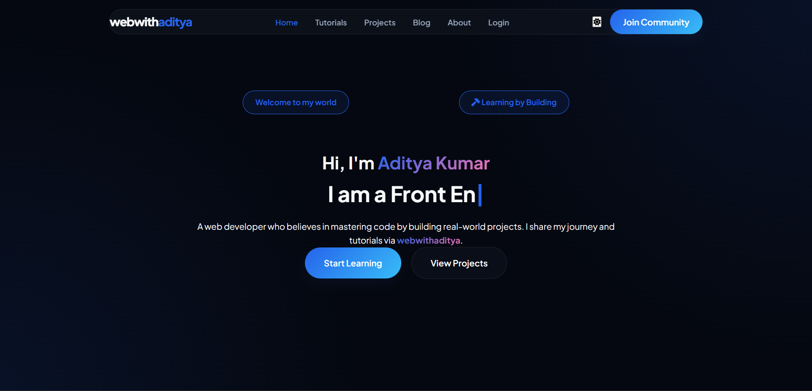
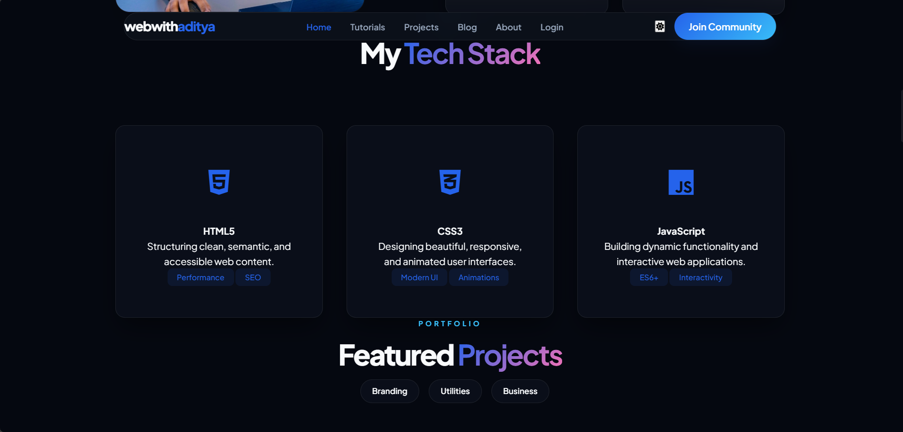
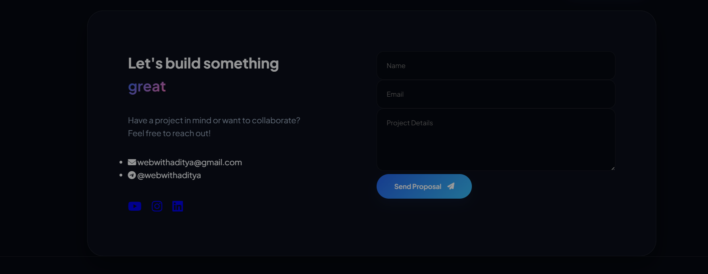

# 🌐 Personal Portfolio Website

A modern and responsive personal portfolio website built to showcase my projects, skills, and web development journey.

---

## 🚀 Live Demo

👉 [View Portfolio](https://adityakumarweb.github.io/personal_portfolio/)

---

## ✨ Features

* Modern and clean UI
* Fully responsive design
* Smooth scrolling navigation
* Projects showcase section
* Skills and technologies section
* Contact section
* Mobile-friendly layout

---

## 🛠️ Tech Stack

* HTML5
* CSS3
* JavaScript

---

## 📸 Screenshot



### Tech Stack


### Contact Section


---

## ⚡ Getting Started

Clone the repository:

```bash id="udq4m0"
git clone https://github.com/adityakumarweb/personal_portfolio.git
```

Open the project folder:

```bash id="m6f3b1"
cd personal_portfolio
```

Run the project by opening `index.html` in your browser.

---

## 📬 Contact

* GitHub: [@adityakumarweb](https://github.com/adityakumarweb)
* Portfolio: [Visit Website](https://adityakumarweb.github.io/personal_portfolio/)

---

## ⭐ Support

If you like this project, consider giving it a star ⭐ on GitHub.

---


